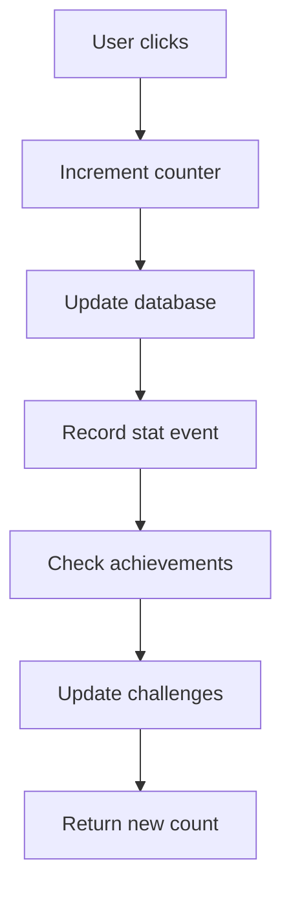

# Clicker Game

## Overview

The Clicker Game is a simple yet engaging incremental game where users click to increase their counter and earn points. It serves as both entertainment and a way to contribute to the ranking system.

## Core Mechanics

### Basic Clicking

1. **Click Action**: User clicks the clicker button
2. **Counter Increment**: Global counter increases by 1
3. **Point Awarding**: Each click can earn points for the user's ranking
4. **Persistence**: Click count is saved to database

### Point Conversion

- **Conversion Rate**: 1 click = 1 point (configurable)
- **Points Category**: `clicker` - Identifies points as clicker-game earned

### Counter Persistence

The click counter is stored in the database and persists across:
- Game sessions
- Server restarts
- Multiple users

## Game States

### Active State
- Counter is clickable
- Clicks increment normally
- Points are awarded to user
- Real-time updates

### Reset State
- Counter returns to 0
- All accumulated clicks are lost
- Points earned remain in rankings
- Requires manual reset action

## API Endpoints

### Get Click Count
```
GET /api/clicks
```

Returns the current click counter value.

**Response:**
```json
{
  "count": 42,
  "timestamp": "2024-02-08T12:00:00.000Z"
}
```

### Increment Click
```
POST /api/clicks/increment
```

Increments the click counter by 1.

**Response:**
```json
{
  "count": 43,
  "timestamp": "2024-02-08T12:00:01.000Z"
}
```

### Reset Counter
```
POST /api/clicks/reset
```

Resets the click counter to 0.

**Response:**
```json
{
  "count": 0,
  "timestamp": "2024-02-08T12:00:02.000Z"
}
```

### Convert Clicks to Points
```
POST /api/clicks/add-points
```

Converts clicks to ranking points for a user.

**Request Body:**
```json
{
  "userId": "user123",
  "clicks": 50
}
```

**Response:**
```json
{
  "success": true,
  "points": 50,
  "message": "Added 50 points to rankings"
}
```

## Integration with Stats System

The Clicker Game integrates with the stats system for tracking:

### Recorded Stats
- **click**: Individual click events
- **score**: Session scores
- **session_end**: Game session completion

### High Scores
- Tracks highest scores per user
- Updates leaderboard automatically
- Records timestamp of new records

### Daily Challenges
Supports clicker-specific daily challenges:
- **Click count**: Complete X clicks
- **Score milestones**: Achieve specific scores

## Technical Implementation

### Database Schema
Clicks are stored in the main database with tracking for:
- Total click count
- Individual click events (via stats system)
- User-specific stats

### Click Flow



## Persistence Strategy

### What Persists
- Global click counter
- User click stats
- High scores
- Achievement progress

### What Resets
- Current session click count (when manually reset)
- Temporary game state

## Use Cases

1. **Casual Entertainment**: Simple clicking for fun
2. **Ranking Building**: Earn points through clicking
3. **Challenge Completion**: Participate in daily challenges
4. **Achievement Hunting**: Unlock clicker-specific achievements

## Game Balance

### Current Settings
- **Click multiplier**: 1x (1 click = 1 point)
- **Reset behavior**: Manual only
- **Multiplayer**: Shared counter (all users contribute)

### Future Enhancements
Potential additions:
- Click upgrades (multiple points per click)
- Auto-clickers
- Prestige system
- Individual user counters
- Time-based bonuses

## Related Features

- [Ranking System](./ranking-system.md) - Points contribute to global rankings
- [Stats System](./fishing-game.md#stats-integration) - Shared stats tracking
- [Achievements](#daily-challenges) - Clicker-specific achievements
