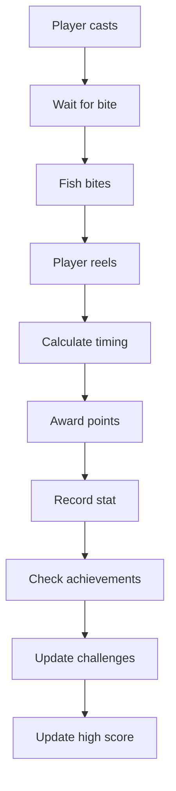

# Fishing Game

## Overview

The Fishing Game is a skill-based mini-game where players cast their line, catch fish, and earn points based on the quality and rarity of their catches. It features timing mechanics, fish rarity tiers, and a competitive leaderboard.

## Core Mechanics

### Fishing Process

1. **Casting**: Player initiates a cast
2. **Waiting**: A random wait time occurs (simulating fish behavior)
3. **Hooking**: Fish bites - timing window opens
4. **Reeling**: Player must reel at the right time to catch
5. **Scoring**: Points awarded based on fish quality and timing

### Fish Rarity Tiers

Fish are categorized by rarity, affecting point values:

- **Common** (Bronze): 1-10 points
- **Uncommon** (Silver): 11-25 points
- **Rare** (Gold): 26-50 points
- **Epic** (Purple): 51-100 points
- **Legendary** (Orange): 101-200 points
- **Mythical** (Red): 201-500 points

### Timing Mechanics

- **Bite Window**: 1-3 seconds to react after bite
- **Perfect Reel**: Full points (100%)
- **Good Reel**: 75% of max points
- **Early/Late Reel**: 50% of max points
- **Miss**: 0 points, fish escapes

## Game States

### Idle State
- Waiting for player to cast
- No active fishing session

### Waiting State
- Line is cast
- Waiting for fish to bite
- Random delay: 2-8 seconds

### Biting State
- Fish has bitten
- Reeling window open (1-3 seconds)
- Player must react quickly

### Reeling State
- Player is reeling
- Timing precision calculated
- Points awarded based on accuracy

## Scoring System

### Base Points

Points are calculated as:
```
Base Points = Fish Rarity Base Value × Reel Multiplier
```

### Multipliers

- **Perfect Reel**: 1.0x (100% of base)
- **Good Reel**: 0.75x (75% of base)
- **Fair Reel**: 0.5x (50% of base)
- **Miss**: 0x (no points)

### Combo System

Consecutive successful catches build combos:
- **2x Combo**: 1.25x multiplier
- **3x Combo**: 1.5x multiplier
- **5x Combo**: 2x multiplier
- **10x Combo**: 3x multiplier

Combo resets on miss.

## API Endpoints

### Record Fish Catch
```
POST /api/stats/record
```

Records a fish catch event.

**Request Body:**
```json
{
  "userId": "user123",
  "userName": "Player",
  "gameType": "fishing",
  "statType": "fish_caught",
  "value": 1,
  "metadata": {
    "rarity": "rare",
    "points": 45,
    "timing": "perfect"
  }
}
```

**Response:**
```json
{
  "success": true,
  "message": "Stat recorded successfully"
}
```

### Record Score
```
POST /api/stats/record
```

Records a fishing session score.

**Request Body:**
```json
{
  "userId": "user123",
  "userName": "Player",
  "gameType": "fishing",
  "statType": "score",
  "value": 250,
  "metadata": {
    "fishCaught": 8,
    "comboMax": 3
  }
}
```

### End Session
```
POST /api/stats/record
```

Records end of fishing session.

**Request Body:**
```json
{
  "userId": "user123",
  "userName": "Player",
  "gameType": "fishing",
  "statType": "session_end",
  "value": 1,
  "metadata": {
    "duration": 300,
    "totalScore": 250,
    "totalFish": 8
  }
}
```

### Update High Score
```
POST /api/stats/highscore
```

Updates or inserts a high score.

**Request Body:**
```json
{
  "userId": "user123",
  "userName": "Player",
  "gameType": "fishing",
  "score": 500,
  "details": {
    "fishCaught": 15,
    "maxCombo": 5
  }
}
```

**Response:**
```json
{
  "success": true,
  "isNewRecord": true,
  "score": 500,
  "message": "New high score for fishing: 500"
}
```

### Get Leaderboard
```
POST /api/stats/leaderboard
```

Gets the fishing leaderboard.

**Request Body:**
```json
{
  "gameType": "fishing",
  "limit": 10
}
```

**Response:**
```json
{
  "gameType": "fishing",
  "leaderboard": [
    {
      "rank": 1,
      "userId": "user123",
      "userName": "Player",
      "gameType": "fishing",
      "score": 500,
      "recordedAt": "2024-02-08T12:00:00.000Z",
      "updatedAt": "2024-02-08T12:00:00.000Z"
    }
  ]
}
```

### Get User Stats
```
POST /api/stats/user
```

Gets aggregated fishing stats for a user.

**Request Body:**
```json
{
  "userId": "user123",
  "gameType": "fishing"
}
```

**Response:**
```json
{
  "userId": "user123",
  "gameType": "fishing",
  "totalFishCaught": 150,
  "highScore": 500,
  "totalSessions": 25
}
```

## Stats Integration

The fishing game integrates with the stats system:

### Tracked Metrics
- **fish_caught**: Number of fish caught
- **score**: Session scores
- **session_end**: Session completion events

### Stored Data
- **Individual catches**: Fish rarity, points, timing
- **Session totals**: Total score, fish count, duration
- **High scores**: Best scores per user
- **Historical data**: Full catch history

## Daily Challenges

Fishing-specific daily challenges include:

- **Catch X fish**: Complete a set number of catches
- **Score X points**: Achieve a target score
- **Catch X rare fish**: Catch specific rarity fish
- **X combo streak**: Achieve a combo streak

## Achievements

Fishing achievements reward:

- **First Catch**: Catch your first fish
- **Master Angler**: Catch 100 fish
- **Legendary Catch**: Catch a legendary fish
- **Combo Master**: Achieve a 10x combo
- **High Roller**: Score 500+ points

## Technical Implementation

### Data Flow



### Randomization

- **Wait time**: 2-8 seconds (uniform distribution)
- **Fish rarity**: Weighted random (more common = higher chance)
- **Bite window**: 1-3 seconds (uniform distribution)

## Persistence

### What's Saved
- Individual catch records
- Session summaries
- High scores
- Achievement progress
- Challenge progress

### Session State
- Current combo
- Session score
- Fish caught this session

## Use Cases

1. **Casual Play**: Relaxing fishing experience
2. **Skill Competition**: Compete for high scores
3. **Achievement Hunting**: Unlock all fishing achievements
4. **Daily Challenges**: Complete daily fishing goals
5. **Ranking Building**: Earn points for global rankings

## Game Balance

### Current Settings
- **Wait range**: 2-8 seconds
- **Reaction window**: 1-3 seconds
- **Rarity weights**: Common (50%), Uncommon (25%), Rare (15%), Epic (7%), Legendary (2%), Mythical (1%)
- **Combo decay**: Resets on miss

### Difficulty Scaling
As players improve:
- Catch rates remain consistent
- Higher rarities still rare
- Skill-based timing still matters

## Related Features

- [Ranking System](./ranking-system.md) - Points contribute to rankings
- [Stats System](#stats-integration) - Shared stats tracking with Clicker
- [Achievements](#achievements) - Fishing-specific achievements
